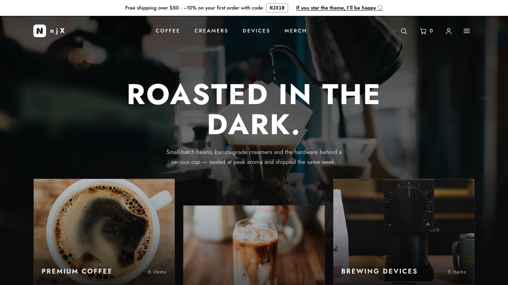
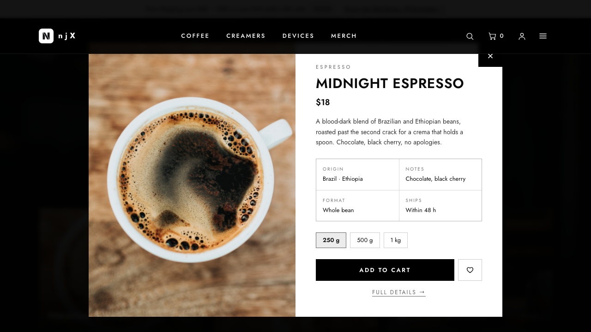
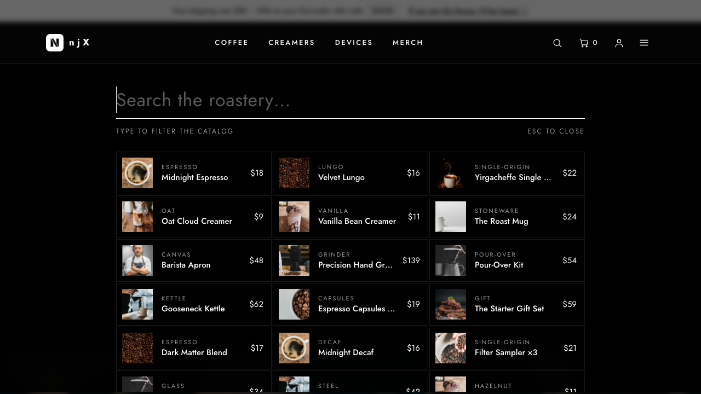

# astro-njx-dark-lux — monochrome dark-luxury ecommerce theme for Astro

A complete storefront built with **Astro 5 + Tailwind CSS v4** in a pure-monochrome
dark-luxury design system: hairline borders that light up on hover, zero border-radius,
wide letter-spacing, quick-view popups — wired for **Shopify** out of the box and
deployable to **Cloudflare Pages** (or any static host) in minutes.

**Live demo → [astro-njx-dark-lux.pages.dev](https://astro-njx-dark-lux.pages.dev)**
Everything in the demo — cart, quick view, search, checkout — is this theme running on mock data.



## What is this?

A **static storefront**: Astro renders every page to plain HTML at build time, so the
site is fast by default and hosting is essentially free. Product data comes from a
pluggable provider — start with the bundled JSON catalog, then flip one environment
variable and the same pages build from your **real Shopify store**, with Shopify's
hosted checkout handling payments.

Made for coffee roasters, bars, beauty studios and any brand that sells with a
black-and-white, editorial-luxury voice.

## Features

- 🖤 **A real design system** — monochrome palette, hairline interactive borders,
  diagonal-offset category grid, uppercase tracking type (Jost, Uni Sans-ready)
- 🔍 **Overlay search** — giant underlined input on dark glass, live results as
  spec rows, click opens the quick view; page dims and locks behind it
- ⚡️ **Quick-view popup** — any product card opens a centered white card over a
  blurred overlay: spec grid (origin / notes / format / ships), variants, add to cart.
  Real `/products/` pages remain for SEO and deep links
- 🛒 **Cart as a popup** — same visual family; persistent (localStorage), quantities,
  line remove, clear all, hands off to Shopify's hosted checkout
- 💾 **Saved for later inside the cart** — hearts don't need a separate wishlist page
- 📱 **Touch-aware cards** — on devices without hover, the cards on screen reveal
  their actions automatically (IntersectionObserver)
- 🎚 **Light/dark as composition** — dark home & catalogs, white content pages,
  invertible cards and FAQ items via one-class token remaps
- 🔌 **Two data providers, one switch** — `COMMERCE_PROVIDER=mock` (bundled JSON)
  or `shopify` (live products over the Storefront API)
- 📝 **All copy in two constants files** — rebrand every text without touching markup
- 📄 **20+ pages** — home, collections with filters & counts, product pages, about,
  contacts, FAQ with inverting accordion, account UI, privacy, terms, honest 404
- ⚡️ **Zero client framework** — a few small vanilla scripts; no React/Vue cost

| Quick view | Search |
| --- | --- |
|  |  |

## Quick start

```bash
git clone https://github.com/njbSaab/astro-njx-dark-lux.git my-store
cd my-store
npm install
cp .env.example .env        # defaults to the mock catalog
npm run dev                 # http://localhost:4321
```

That's it — the store runs on the bundled demo catalog (`src/data/mock-catalog.json`).
Edit that file to see your own products immediately.

## Connect your Shopify store

1. In Shopify admin: **Settings → Apps and sales channels → Develop apps → Create an app.**
2. Give it the *Storefront API* scopes (unauthenticated read products/collections/checkouts).
3. Install the app and copy the **Storefront API access token** (this token is public-safe).
4. Update `.env`:

```bash
COMMERCE_PROVIDER=shopify
PUBLIC_SHOPIFY_DOMAIN=your-store.myshopify.com
PUBLIC_SHOPIFY_STOREFRONT_TOKEN=xxxxxxxxxxxxxxxx
```

5. `npm run build` — the same pages now build from your live catalog, and the cart
   creates a real Shopify cart and redirects to your hosted checkout.

The provider interface lives in `src/lib/commerce/` — adding WooCommerce, Medusa or
your own API means implementing one small TypeScript interface.

## Deploy

Any static host works. For Cloudflare Pages:

```bash
npm run build
npx wrangler pages deploy dist --project-name my-store
```

The whole store fits comfortably in Cloudflare's free tier.

## Make it yours

- **All copy in two files** — `src/constants/components.ts` (header, footer, cart,
  search, popups) and `src/constants/pages.ts` (home, about, FAQ, product page, …).
- **Design tokens** — one `@theme` block in `src/styles/global.css`; the light/dark
  composition is driven by three tiny remap classes (`.light-section`, `.dark-card`,
  `.site-footer`) plus a `lightPage` prop per page.
- **Type** — Jost ships by default; drop in Uni Sans by editing two token lines.
- **Catalog** — `src/data/mock-catalog.json` + photos in `public/products/`, or Shopify.

## Project structure

```
src/
├── constants/              # ALL copy: components.ts + pages.ts
├── data/mock-catalog.json  # demo products & collections (22 items, spec meta)
├── layouts/Layout.astro    # header, search overlay, cart & quick-view popups, menu
├── components/ProductCard.astro
├── lib/
│   ├── commerce/           # provider interface + mock & shopify implementations
│   ├── cart.ts             # persistent cart (nanostores)
│   └── favorites.ts        # saved-for-later store
└── pages/                  # index, collections/, products/, about, faq, …
```

## Sibling themes & Pro

Same engine, different voices: **[astro-njx-store](https://github.com/njbSaab/astro-njx-store)**
(warm paper-and-pine) and **[astro-njx-boutique](https://github.com/njbSaab/astro-njx-boutique)**
(editorial fashion). An extended **Pro** version of this theme (command palette,
mega menu, reviews, customer accounts) is on the way — watch the repo to get notified.

## Credits

Made by [njX](https://njxui.dev) — also the author of [njx-ui](https://njxui.dev), a
classless-friendly CSS library for landings. Photos: [Unsplash](https://unsplash.com).

If this theme saves you time, a star on GitHub would make my day ♡
